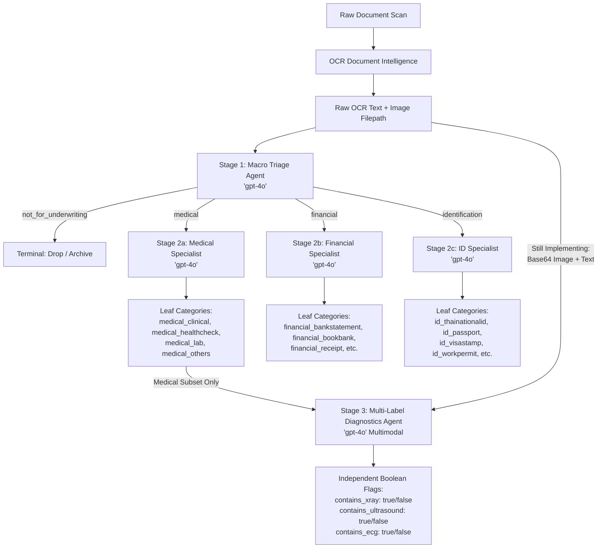

# Document Classification & Multi-Label Pipeline: Evaluation Report

**Project:** Document Classification  
**Date:** 21 July 2026  
**Models Evaluated:** `gpt-4o` (Macro) | `gpt-4o` (Specialists) | `gpt-4o` (Multimodal Imaging)

---

## Executive Summary

This report evaluates the performance of the multi-agent AI pipeline to automate classification for underwriting. 

The evaluation is divided into three core stages:
1. **Stage 1: Macro Classification** (4-Domain Triage)
2. **Stage 2: End-to-End (E2E) Classification** (Granular Subclass Routing)
3. **Stage 3: Multi-Label Diagnostic Tagging** (Independent X-Ray, Ultrasound, ECG detection)

---

## 1. Stage 1: Macro Classification Performance

The Macro Agent routes incoming raw OCR documents into one of four primary domains:
* `medical`
* `financial`
* `identification`
* `not_for_underwriting`

### Overall Macro Metrics

| Metric | Score | Notes / Benchmark Target |
| :--- | :---: | :--- |
| **Accuracy** | `[INSERT %]` | Target: > 95% |
| **Precision (Macro Avg)** | `[INSERT %]` | Balanced across all 4 domains |
| **Recall (Macro Avg)** | `[INSERT %]` | Minimizes misrouting to wrong domain |
| **F1-Score (Macro Avg)** | `[INSERT %]` | Harmonic mean of Precision & Recall |

### Domain-Level Metrics Breakdown

| Domain Label | Support (Count) | Precision | Recall | F1-Score |
| :--- | :---: | :---: | :---: | :---: |
| `medical` | `[N]` | `[0.XX]` | `[0.XX]` | `[0.XX]` |
| `financial` | `[N]` | `[0.XX]` | `[0.XX]` | `[0.XX]` |
| `identification` | `[N]` | `[0.XX]` | `[0.XX]` | `[0.XX]` |
| `not_for_underwriting` | `[N]` | `[0.XX]` | `[0.XX]` | `[0.XX]` |

### Macro Confusion Matrix

> **Rows:** Ground Truth | **Columns:** Predicted

| Ground Truth \ Predicted | medical | financial | identification | not_for_underwriting |
| :--- | :---: | :---: | :---: | :---: |
| **medical** | **`[TP]`** | `[FN]` | `[FN]` | `[FN]` |
| **financial** | `[FN]` | **`[TP]`** | `[FN]` | `[FN]` |
| **identification** | `[FN]` | `[FN]` | **`[TP]`** | `[FN]` |
| **not_for_underwriting** | `[FN]` | `[FN]` | `[FN]` | **`[TP]`** |

---

## 2. Stage 2: End-to-End (E2E) Classification Performance

The E2E evaluation measures full-pipeline performance: taking a raw document from Macro through the Specialist Agent to predict the final leaf subcategory (e.g., `id_thainationalid`, `financial_bankstatement`, `medical_clinical`, `not_for_underwriting`).

### E2E Summary Metrics

| Metric | Score |
| :--- | :---: |
| **E2E Exact Match Accuracy** | `[INSERT %]` |
| **Weighted F1-Score** | `[0.XX]` |
| **Macro F1-Score** | `[0.XX]` |
| **Total Test Samples** | `[N]` |

### Specialist Subclass Accuracy Summary

* **Medical Specialist Accuracy:** `[INSERT %]`
* **Financial Specialist Accuracy:** `[INSERT %]`
* **Identification Specialist Accuracy:** `[INSERT %]`

---

## 3. Stage 3: Multi-Label Medical Diagnostics Tagging

Because medical documents can simultaneously contain multiple diagnostic findings (e.g., a hospital visit note containing both an ECG reading and a chest X-ray impression), this task uses **independent boolean flags** rather than single-choice classification.

### Multi-Label Metric Methodology
* Standard single-class confusion matrices do not apply to multi-label problems.
* **Exact Match Ratio (Subset Accuracy):** The percentage of documents where *all three flags* (`xray`, `ultrasound`, `ecg`) perfectly match ground truth.
* **Per-Label Metrics:** Precision, Recall, and F1 are calculated independently for each diagnostic modality.

### Global Multi-Label Performance

| Metric | Score | Description |
| :--- | :---: | :--- |
| **Exact Match Ratio** | **`[INSERT %]`** | Documents where all 3 flags were 100% correct |
| **Average Per-Label Accuracy** | **`[INSERT %]`** | Mean accuracy across individual boolean flags |

### Per-Modality Breakdown

| Modality Flag | Ground Truth Positive | Precision | Recall | F1-Score | Individual Accuracy |
| :--- | :---: | :---: | :---: | :---: | :---: |
| **Contains X-Ray** | `[N]` | `[0.XX]` | `[0.XX]` | `[0.XX]` | `[INSERT %]` |
| **Contains Ultrasound** | `[N]` | `[0.XX]` | `[0.XX]` | `[0.XX]` | `[INSERT %]` |
| **Contains ECG** | `[N]` | `[0.XX]` | `[0.XX]` | `[0.XX]` | `[INSERT %]` |

### Per-Modality 2x2 Confusion Matrices

#### 1. X-Ray (`contains_xray`)
| Ground Truth \ Pred | Predicted: FALSE | Predicted: TRUE |
| :--- | :---: | :---: |
| **GT: FALSE** | **TN:** `[N]` | **FP:** `[N]` |
| **GT: TRUE** | **FN:** `[N]` | **TP:** `[N]` |

#### 2. Ultrasound (`contains_ultrasound`)
| Ground Truth \ Pred | Predicted: FALSE | Predicted: TRUE |
| :--- | :---: | :---: |
| **GT: FALSE** | **TN:** `[N]` | **FP:** `[N]` |
| **GT: TRUE** | **FN:** `[N]` | **TP:** `[N]` |

#### 3. ECG (`contains_ecg`)
| Ground Truth \ Pred | Predicted: FALSE | Predicted: TRUE |
| :--- | :---: | :---: |
| **GT: FALSE** | **TN:** `[N]` | **FP:** `[N]` |
| **GT: TRUE** | **FN:** `[N]` | **TP:** `[N]` |

---