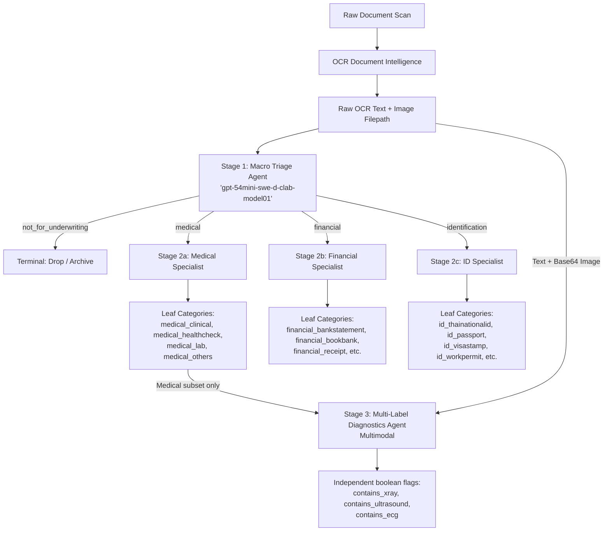

# Document Classification & Multi-Label Pipeline

Multi-agent LLM pipeline that triages raw underwriting document scans into
`medical` / `financial` / `identification` / `not_for_underwriting`, routes each
to a specialist agent for a granular subcategory, and independently tags
medical documents for X-Ray / Ultrasound / ECG content.

**Deployment:** `gpt-54mini-swe-d-clab-model01` &nbsp;|&nbsp; **Last evaluated:** 23 Jul 2026 &nbsp;|&nbsp; **Sample size:** ~1,120 documents

---

## Performance at a Glance

**Multimodal (OCR text + image) beats text-only on 4 of 5 accuracy metrics**, at the cost of higher latency and input tokens from processing the image.

| Metric | Multimodal | Text-only | Winner |
|---|---:|---:|---|
| Macro accuracy | **97.78%** | 96.72% | Multimodal |
| End-to-end accuracy | **88.79%** | 87.67% | Multimodal |
| Medical specialist accuracy | **82.58%** | 82.30% | Multimodal |
| Financial specialist accuracy | 95.97% | **96.67%** | Text-only |
| Identification specialist accuracy | **92.20%** | 91.94% | Multimodal |
| Avg. end-to-end latency | 4.18s | **2.84s** | Text-only |
| Avg. end-to-end input tokens | 4,280 | **3,567** | Text-only |
| Avg. end-to-end output tokens | 28.2 | 28.3 | ~tie |

Financial is the one metric where text-only wins, and by a small margin
(−0.70pp) relative to the end-to-end accuracy gain multimodal delivers
(+1.12pp) — so **multimodal is the better default** unless the ~1.3s and
~700-token-per-document extra cost is prohibitive at your volume.

> Full confusion matrices, per-class precision/recall/F1, and the multi-label
> imaging results are generated on demand from the raw run data — see
> [Generating the full report](#generating-the-full-report).

---

## Architecture



Each stage is scored independently and logs its own latency + token usage, so
macro triage, specialist routing, and multi-label tagging can be evaluated
(and swapped between text-only / multimodal) without re-running the others.

---

## Project Structure

```
document_classification/
├── document_classifier.py     # Stage 1+2: macro triage -> specialist cascade
├── medical_imaging_flags.py   # Stage 3: multi-label X-Ray/Ultrasound/ECG tagging
├── review.py                  # Streamlit dashboard: macro & specialist confusion matrices
├── flag_review.py             # Streamlit dashboard: multi-label review + drill-down
└── generate_report.py         # Builds a single static HTML report from run CSVs
```

| File | Type | Purpose |
|---|---|---|
| [`document_classifier.py`](document_classifier.py) | library | Runs the macro → specialist cascade over a DataFrame, checkpointing results to CSV as it goes |
| [`medical_imaging_flags.py`](medical_imaging_flags.py) | library | Runs the independent multi-label imaging tagger over medical documents |
| [`review.py`](review.py) | Streamlit app | Interactive macro/specialist confusion matrix + per-sample drill-down (needs the repo + a running Streamlit server) |
| [`flag_review.py`](flag_review.py) | Streamlit app | Interactive multi-label (X-Ray/Ultrasound/ECG) review + per-sample drill-down |
| [`generate_report.py`](generate_report.py) | CLI script | Turns run CSVs into one offline, shareable `.html` report — for people who can't access the repo or run Streamlit |

---

## How to Use

### 1. Run the classification cascade — `document_classifier.py`

Imported and driven from a notebook, not a CLI. `df` needs an OCR text column
and an image filepath column.

```python
from document_classifier import run_cascade_batch_checkpointed
from openai import AzureOpenAI

client = AzureOpenAI(...)

# text-only run
df_text = run_cascade_batch_checkpointed(
    df, client, text_col="ocr_text", img_col="filepath",
    use_vision=False, checkpoint_path="results_text_only.csv",
)

# multimodal run (OCR text + image)
df_image = run_cascade_batch_checkpointed(
    df, client, text_col="ocr_text", img_col="filepath",
    use_vision=True, checkpoint_path="results_multimodal.csv",
)
```

Reruns with the same `checkpoint_path` resume — already-processed rows (by
`img_col`) are skipped.

### 2. Tag medical imaging findings — `medical_imaging_flags.py`

Run on the medical-domain subset of a `document_classifier.py` result.

```python
from medical_imaging_flags import run_imaging_flags_batch

medical_rows = df_image[df_image["macro_decision"] == "medical"]
flags_df = run_imaging_flags_batch(
    medical_rows, client, text_col="ocr_text", img_col="filepath", use_vision=True,
)
flags_df.to_csv("flags_multimodal.csv", index=False)
```

### 3. Interactive review dashboards — `review.py` / `flag_review.py`

```bash
pip install streamlit pandas plotly
streamlit run review.py       # macro_gt vs macro_decision, ground_truth vs final_subcategory
streamlit run flag_review.py  # xray/ultrasound/ecg gt vs predicted
```

Upload the result CSV (or point it at a path) in the sidebar once the app is running.

### 4. Generate the shareable static report — `generate_report.py`

```bash
pip install pandas plotly
python3 generate_report.py --results results_multimodal.csv --flags flags_multimodal.csv --output report.html
```

See [Generating the full report](#generating-the-full-report) below for the
comparison mode used to produce the table at the top of this README.

---

## Generating the Full Report

The numbers in [Performance at a Glance](#performance-at-a-glance) — and the
full confusion matrices / per-class metrics / multi-label breakdown behind
them — are computed straight from the run CSVs, not hand-maintained here.
That keeps this README from going stale and lets anyone regenerate the report
once new raw data lands.

```bash
python3 generate_report.py \
  --results results_multimodal.csv --run-label Multimodal \
  --compare-results results_text_only.csv --compare-label "Text-only" \
  --flags flags_multimodal.csv --compare-flags flags_text_only.csv \
  --title "Document Classification -- Evaluation Report" \
  --output classification_report.html
```

The output is a single `.html` file (Plotly is bundled inline, no CDN or
internet access needed to view it) — safe to email or drop in a shared drive
for people who don't have repo access. It includes:

- **Stage 1 — Macro triage**: confusion matrix + per-domain precision/recall/F1 (`macro_gt` vs `macro_decision`)
- **Stage 2 — End-to-end subcategory**: confusion matrix + per-class metrics (`ground_truth` vs `final_subcategory`), plus accuracy broken down by domain
- **Stage 3 — Multi-label imaging** *(if `--flags` given)*: exact match ratio, per-modality precision/recall/F1/accuracy, 2×2 confusion matrices for X-Ray/Ultrasound/ECG
- **Latency & token distributions** per stage (box plots + mean/median/P95)
- **Head-to-head comparison** *(if `--compare-results` given)*: the two runs side by side, same shape as the table at the top of this README

Required columns are documented in the `generate_report.py` module docstring;
missing optional columns (e.g. no token/latency logging) just skip that chart
instead of failing.
